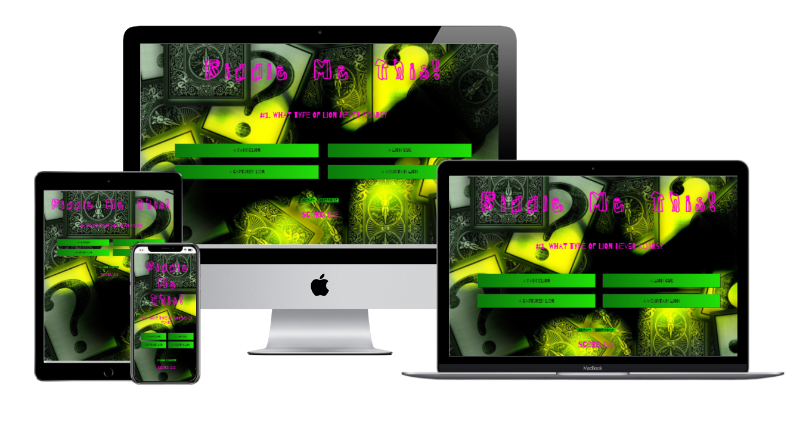
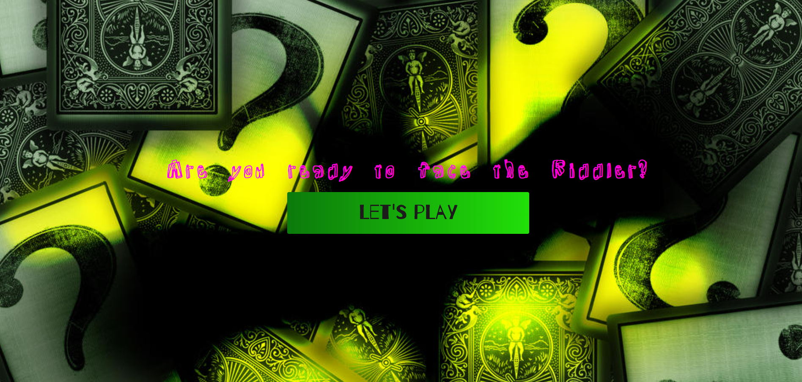
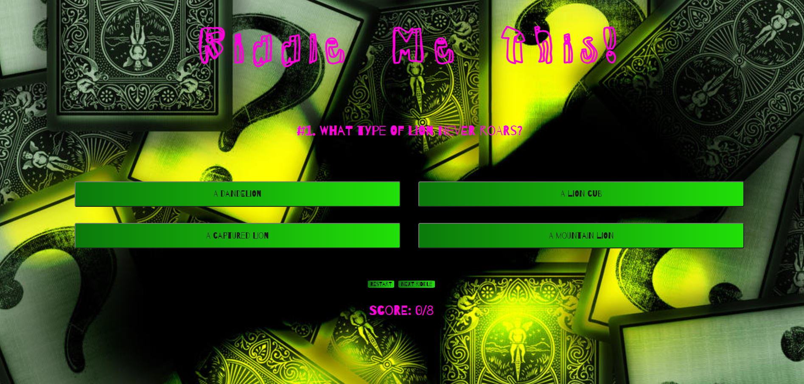
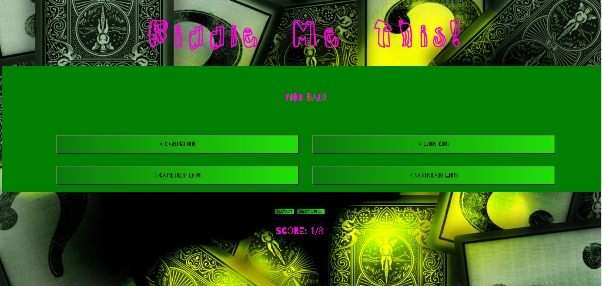
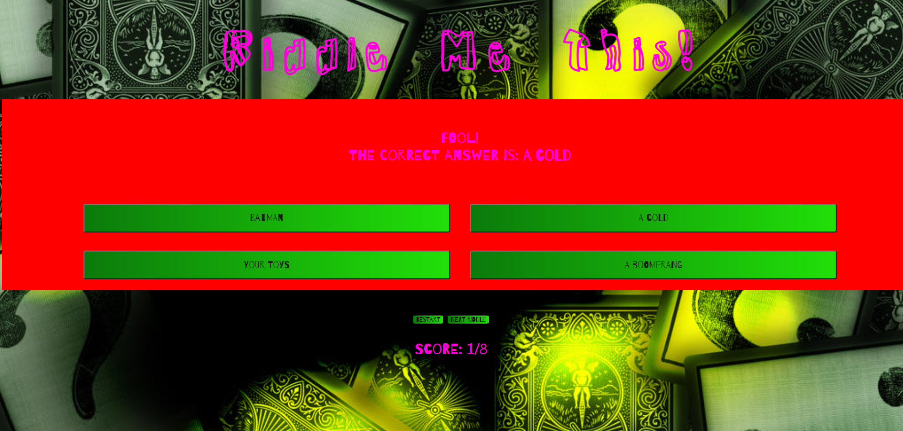
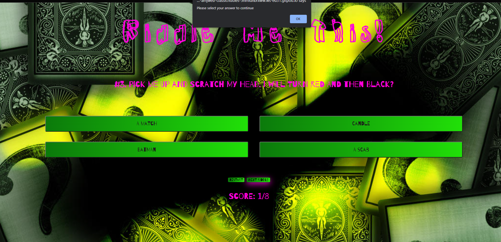

# The Riddler's Riddles

The Riddler's Riddles is a Batman themed quiz to challange the user with some classic riddles.  

## **Features**

- **Front Page** 
  - The first thing that the user sees is a Riddler themed background with a welcome message/
  challenge, along with a let's play button to start the quiz. 

  

  - **Quiz Page**
  - The quiz has eight questions with four multiple choice answers to chose from. 

  - A correct answer displays a green background and message.

  - An incorrect answer displays a red background and the correct answer.

- **Navigation**
  - For navigation the header will take the user back to the front page.

  - The "Next Riddle" button will take the user to the next riddle but only after they have selected an answer. An alert will be displayed if they try to move on without doing so. 

  - The button named 'Restart' will allow the user to start again.

  

  ### Validator Testing
- HTML
    - No errors were found when passing through the official [W3C Validator](https://validator.w3.org/nu/?doc=https%3A%2F%2F8000-amjweb-riddlersriddles-4rgoof1i0r5.ws-eu31.gitpod.io%2Friddles.html)

- CSS
    - No errors were found when passing through the official [(Jigsaw) Validator](https://jigsaw.w3.org/css-validator/validator?uri=https%3A%2F%2F8000-amjweb-riddlersriddles-4rgoof1i0r5.ws-eu31.gitpod.io%2Findex.html&profile=css3svg&usermedium=all&warning=1&vextwarning=&lang=en)

- JavaScript
    - No errors were found when passing through the [JSHint Validator](https://jshint.com/)

  ### Unfixed Bugs
No unfixed bugs

## Deployment

- The site was deployed to GitHub pages. The steps to deploy are as follows:
    - In the GitHub repository, navigate to the Settings tab
    - From the source section drop-down menu, select the Master Branch
    - Once the master branch has been selected, the page will be automatically refreshed with a detailed ribbon display to indicate the successful deployment.

The live link can be found here: [The Riddler's Riddles](https://amj-web.github.io/Riddlers-Riddles/)

## Credits

### Content
- The code for the buttons was taken from [Brain Design](https://www.youtube.com/watch?v=f4fB9Xg2JEY)

- The code for the question array was taken from [SitePoint](https://www.sitepoint.com/simple-javascript-quiz/)

- The code for the function to reveal the correct answer was modified from Code Institute's "JavaScript Essentials" course.

### Media
- The background image was taken from [Deviant Art](https://www.deviantart.com/nazsha/art/Batman-Riddler-Wallpaper-199978287)  
